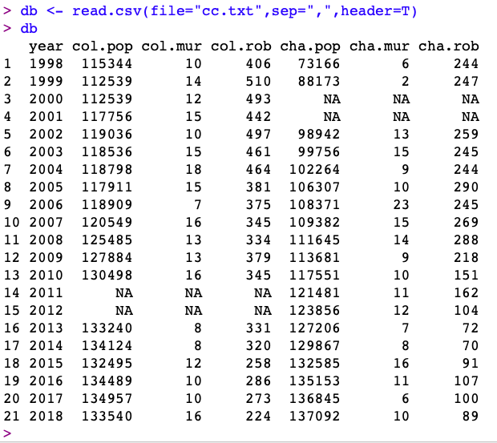
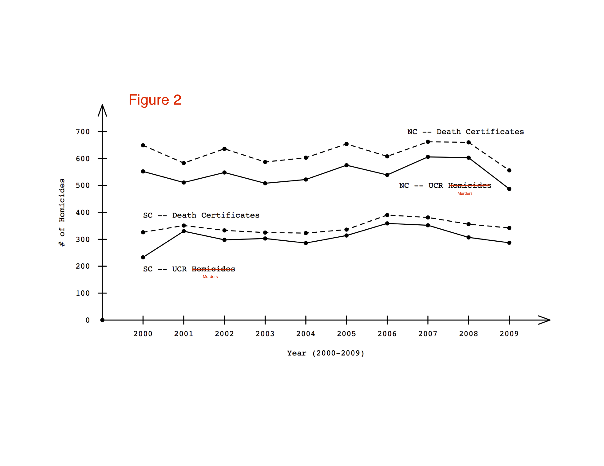

### Communities and Crime (CRJU 430-004)

* Semester: Fall 2020
* Class Meets: Asynchronous, Online
* Instructor: Robert Brame 
* Email: rwb@sc.edu
* Online office meetings at 3:00-3:30(ET) on Tuesdays and by appointment.

#### Class Description

Relationship between criminality and community characteristics, with particular attention to how variation in community structure, organization, and culture impacts crime.

#### Learning Outcomes

This course prepares you to: (1) describe problems of crime measurement at the local level; (2) explain why communities have become an important organizing framework for criminology; and (3) evaluate various policies and interventions at the community level.

#### Reading

I will assign readings throughout the semester. The readings are all available freely online or through the University library (log in may be required). Each reading is linked within the course outline below.

#### Disability Accommodations

If you have or think you might have a disability, injury, or other condition that could affect your class performance, please contact the [Student Disability Resource Center](https://sc.edu/about/offices_and_divisions/student_disability_resource_center/). I will abide by accommodations recommended by the Disability Resource Center in this course.

#### Academic Integrity Statement

You are expected to practice the highest standards of academic integrity. Any deviation from this expectation will result in a minimum academic penalty of your failing the assignment, and may result in additional disciplinary measures. This includes improper citation of sources, presenting someone else's work as your own, and any other form of academic misrepresentation. Please take a few moments to familarize yourself with the University's expectations for student academic integrity which can be found [here](http://www.sc.edu/policies/ppm/staf625.pdf).

#### Class Format

We have about 14 weeks of class time this semester. With an in-person class, we normally meet 150 minutes per week. I plan to approximate this same level of lecture time (using video recordings) in this asynchronous online course. All course content will be posted on this webpage. You are responsible for developing and maintaining a regular schedule of: (1) monitoring the course webpage for both content and course-related announcements; (2) doing your assigned reading; (3) reviewing the posted content; and (4) completing your assignments in a timely fashion. Please feel free to email me with any questions (either content or logistics).

#### Class Grades

Your grade in this class will be based on your performance on assignments distributed throughout the semester and a series of 3 short papers (each about 3 pages long). Each assignment will include a set of 5 short-answer questions that must be completed within a 30-minute time window (the 30 minute clock will begin to tick once you start the assignment). You can answer each of the questions in no more than 2 or 3 sentences and you are free to use your book and your notes during each assignment but you are required to work independently -- with no assistance from any other person. The questions will be based on reading and lecture material we have covered since the last assignment. Each question will be worth one point toward your final grade at the end of the semester (14 weeks x 5 points per week = 70 points). Each of the three papers will be worth 10 points toward your final grade (3 papers x 10 points per paper = 30 points). I will say more about the papers below. Letter grades will be assigned as follows: A = 90 or more points; B+ = 85-89 points; B = 80-84 points; C+ = 75-79 points; C = 70-74 points; D+ = 65-69 points; D = 60-64 points; F = 59 or fewer points. You can accumulate partial credit for questions when appropriate. Therefore, if you end up with fractional points at the end of the semester, I will round up or down to the nearest round number (i.e., an 89.1 will give you a B+ but an 89.6 will give you an A). You are welcome to discuss grade issues with me during an online office meeting. Please don't send me [emails](https://www.digitaltrends.com/computing/can-email-ever-be-secure/) about your grades.

#### Late Submissions

Each week, the assignment will be open on Blackboard on Thursday and Friday giving you two full days to complete the work. The work will be due on Friday evening by 11:59pm (ET). If you have an extenuating circumstance that requires you to submit an assignment late, I will hear your concern and consider whether a late submission is appropriate. Examples of extenuating circumstances include your or a family member's illness or an incapacity to complete the work due to circumstances beyond your control. Forgetting about the due date for an assignment or a paper is not an extenuating circumstance.  

#### Short Papers

I will evaluate 3 short papers you will write in reaction to three of the articles covered in part 3 of the course outline below. The grading rubric for this paper is:

1. Summarize the central research question (1 point).
2. Clearly state the study's major finding(s) (1 point).
3. Identify the major strengths of the study (1 point).
4. Identify the major weaknesses of the study (1 point).
5. Describe priorities for future research in the area (1 point).
6. 3 pages of writing (1 point).
7. Double-spaced, 1" margins, 12pt font (1 point).
8. Minimal number of spelling and grammatical errors (1 point).
9. Appropriate use of section headings for items 1-5 above (1 point).
10. Paper submitted to Blackboard in pdf format (1 point).

*Note*: Each paper is due by the end of the day (11:59pm) on the dates listed in the course outline below and will count 10 points toward your final grade in the class.

#### Required Technology

Weekly assignments will be posted on Blackboard and you should complete your assignments and monitor your grades there. It is your responsibility to have a properly functioning computer and web access so you can successfully learn the material in this course. 

#### Course Outline

##### Part 1: Measurement

* Course overview
* Kansas City Gun Experiment ([Sherman et al., 1995](https://www.ncjrs.gov/pdffiles/kang.pdf))
* Uniform Crime Reports ([link](https://arxiv.org/pdf/1204.6735v4.pdf))
* UCR and NCVS ([reading](https://www.bjs.gov/content/pub/pdf/ntcm_2014.pdf))
* National Center for Health Statistics (homicide; [reading](https://www.bjs.gov/content/pub/pdf/ntmh.pdf))
* Most recent National Crime Victimization Survey Report ([link](https://www.bjs.gov/content/pub/pdf/cv18.pdf))
* Community surveys ([this](https://www.theiacp.org/resources/sample-community-surveys), [this](https://www.bjs.gov/content/pub/pdf/cvpcs98.pdf), and [this](https://www.greenvillesc.gov/DocumentCenter/View/9609/2017-Greenville-Police-REPORT-PDF-6-14-17?bidId=))

*Graded Items in Part 1:

* Assignment #1 due on Friday 8/28.
* Assignment #2 due on Friday 9/4.
* Assignment #3 due on Friday 9/11.
* Assignment #4 due on Friday 9/18.
* Assignment #5 due on Friday 9/25.
* First short paper due on Wednesday 9/30/20.

##### Part 2: Theory

* Historical issues: [Jensen (2003)](https://web.archive.org/web/20060828035614/http://sitemason.vanderbilt.edu/files/l/l3Bguk/socdis.pdf)
* Social Disorganization Theory: [Sampson and Groves (1989)](https://dash.harvard.edu/bitstream/handle/1/3226955/Sampson_CommunityStructureCrime.pdf?sequence=2&origin=publication_detail)
* Collective Efficacy: [Sampson, Raudenbush, and Earls (1997)](http://www.d.umn.edu/~jmaahs/MA%20Theory%20Articles/Sampson%20et%20al%20collective%20efficacy.pdf)
* Broken Windows: [Kelling and Wilson (1982)](https://www.theatlantic.com/magazine/archive/1982/03/broken-windows/304465/) 

*Graded Items in Part 2:

* Assignment #6 due on Friday 10/2.
* Assignment #7 due on Friday 10/9.
* Assignment #8 due on Friday 10/16.
* Assignment #9 due on Friday 10/23.
* Second short paper due on Monday 10/26/20.

##### Part 3: Policy Studies

* Kansas City Preventive Patrol Experiment ([Kelling et al., 1974](https://www.policefoundation.org/wp-content/uploads/2015/07/Kelling-et-al.-1974-THE-KANSAS-CITY-PREVENTIVE-PATROL-EXPERIMENT.pdf))
* Washington, DC Gun Study ([Loftin et al., 1991](https://www.nejm.org/doi/pdf/10.1056/NEJM199112053252305))
* The Unsolved Crime Decline ([Rosenfeld, 2004](https://www.jstor.org/stable/pdf/26047601.pdf?casa_token=xQZwYxn1epIAAAAA:e4QKcz1p-mzyzaHsaRE2jDSNyCP7Pg0wAQsSaKk_yg2n74-qVc-JZpRrVX9jx9P3M0y_dE1x1YIF1SSy4_slvXM6C6ilEUI6NzHq3jXTIJhQ4BN8XXI)
* Urban blighted vacant land and crime ([Branas et al., 2018](https://www.pnas.org/content/pnas/115/12/2946.full.pdf))
* Racial profiling and traffic stops ([Grogger and Ridgeway, 2006](https://www.rand.org/content/dam/rand/pubs/reprints/2007/RAND_RP1253.pdf))
* Terror alert levels, police, and crime ([Klick and Tabarrok, 2005](https://mason.gmu.edu/~atabarro/TerrorAlertProofs.pdf))
* Charlotte light rail and crime ([Billings et al., 2011](https://onlinelibrary.wiley.com/doi/full/10.1111/j.1467-9906.2011.00564.x))
* A Ferguson Effect in Chicago? ([Towers and White, 2017](https://rss.onlinelibrary.wiley.com/doi/pdf/10.1111/j.1740-9713.2017.01018.x)

*Graded Items in Part 3:

* Assignment #10 due on Friday 10/30.
* Assignment #11 due on Friday 11/6.
* Assignment #12 due on Friday 11/13.
* Assignment #13 due on Friday 11/20.
* Assignment #14 due during the final exam period.
* Final short paper due on Tuesday 12/1/20.

### Lesson 1 - Wednesday 8/19/20

* Lecture link is [here](https://youtu.be/v9IPanYyCyg).
* Please note that I've turned on close-captioning for the lecture videos.
* Current reading: Sherman et al. (1995) - Kansas City Gun Study ([link](https://www.ncjrs.gov/pdffiles/kang.pdf)).
* First assignment will be open from Thursday 8/27/20 - Friday 8/28/20.

### Lesson 2 - Friday 8/21/20

* Lecture link is [here](https://youtu.be/1CTVAhRul4k).
* Tuesday office hours will occur from 3:00-3:30 on Zoom. I will send Zoom link by email before then.
* Current reading: Sherman et al. (1995) - Kansas City Gun Study ([link](https://www.ncjrs.gov/pdffiles/kang.pdf)).

##### Key Points from this lecture.

* The idea of a community.
* Communities as an organizing framework for the study of crime.
* Counting crimes at the community level.
* Sociology as the dominant contributing discipline to criminology.
* Empirical and normative statements.
* Connections between theory and policy.

### Lesson 3 - Saturday 8/22/20

* Lecture link is [here](https://youtu.be/pOSJrFf3PDE).
* Current reading: Sherman et al. (1995) - Kansas City Gun Study ([link](https://www.ncjrs.gov/pdffiles/kang.pdf)).
* Note: as we go through the Kansas City Gun Experiment, think about how you would write a short paper to address the points in the rubric.

##### Key Points from this lecture.

* The place of before-after research designs in communities and crime research.
* Virtue of before-after designs.
* Problems with before-after designs.
* Responses to the problems with before-after designs.
* Overview of the Kansas City Gun Experiment.
* Theory-policy connections within the Kansas City Gun Experiment
* The idea of a true experiment.

### Lesson 4 - Sunday 8/23/20

* Lecture link is [here](https://youtu.be/taspWZ4XTIA).
* Current reading: Sherman et al. (1995) - Kansas City Gun Study ([link](https://www.ncjrs.gov/pdffiles/kang.pdf)).

##### Key Points from this lecture.

* Goal of the Kansas City Gun Study.
* Theoretical ideas within the Kansas City Gun Study.
* Similarities and differences between the target and comparison beats.
* Police presence in the target and comparison beats.
* Results of the Kansas City Gun Study.
* Crime displacement.
* Future research implications.

### Lesson 5 - Tuesday 8/25/20

* Lecture link is [here](https://youtu.be/bca5b8M9vvI).
* Announcement: Lesson 5 is the last lecture for the first assignment. 

* Note: Beginning this week, a 30-35 minute lecture will be posted each day from Saturday-Tuesday. The material in these lectures will be covered on each week's assignment due on Thursday-Friday; *please remember you will have 30 minutes to work on the assignment and you must complete the assignment in one sitting so be sure to pick a time on Thursday or Friday when you can work on the assignment uninterrupted for 30 minutes*. You do not have to watch the lectures on the days they are posted. You do need to review them before you work on the assignment each week. I will do my best to have the Tuesday lecture posted before office hours on Tuesday afternoon.

* Here are a few practice questions to give you an idea of the kinds of questions I will be asking on the assignments.

1. What is the dominant contributing discipline to criminology? Example Answer: sociology.
2. What is the difference between empirical and normative arguments? Example Answer: an empirical argument draws a conclusion based on facts and evidence while a normative argument draws a conclusion based on a preference or an opinion.
3. Is the Kansas City Gun Experiment a true experiment? Why or why not? Example Answer: no, it is not a true experiment. Experiments require random assignment of cases to treatment and control conditions and the assignment in the Kansas City study wasn't random.
4. What policy change occurred in the KCGE treatment beat? Example Answer: Overtime patrols by police officers focused on illegal gun carrying in hot spots within the target beat.
5. What data can we usually rely on to measure crime at the national level? Example Answer: The FBI's Uniform Crime Reporting Program publishes police statistics while the National Crime Victimization Survey publishes victimization survey results.

##### Key Points from this lecture.

* Counting crime at the community level.
* We examine murder/non-negligent manslaughter and robbery for Columbia and Charleston.
* National Crime Victimization Survey - [link](https://www.bjs.gov/content/pub/pdf/cv18.pdf)
* National Center for Health Statistics - [link](https://www.bjs.gov/content/pub/pdf/ntmh.pdf)
* FBI Uniform Crime Reports - [link](https://www.fbi.gov/services/cjis/ucr/publications)
* Hierarchy rule.
* Missing numbers.
* Effects of changes in the population on the numbers.

### Lesson 6 - Saturday 8/29/20

Lecture link is [here](https://youtu.be/6UvGiAf1JPI).

* Most common method for counting crime at the local level is the FBI's [UCR](https://www.fbi.gov/services/cjis/ucr/publications).
* Voluntary participation in the UCR.
* Next reading of this semester is [here](https://arxiv.org/pdf/1204.6735v4.pdf).
* Question posed early in the article: did crime change in the city of Charlotte from one year to the next?
* We apply this question to the crime of residential burglary

### Lesson 7 - Sunday 8/30/20

* Lecture link is [here](https://youtu.be/FJW-XilO7Tc).
* Current reading is [here](https://arxiv.org/pdf/1204.6735v4.pdf).
* NC state crime reporting program.
* Residential vs commercial burglary
* bp = number of residential burglaries published in the state crime report
* bk = number of residential burglaries known to the local police
* National Incident Based Reporting System (NIBRS) and the hierarchy rule
* pr = fraction of residential burglaries reported to the police (NCVS)

### Lesson 8 - Monday 8/31/20

* Lecture link is [here](https://youtu.be/s2TTqiC8j5s).
* Current reading is [here](https://arxiv.org/pdf/1204.6735v4.pdf).
* Reasons why reporting rate is lower than expected.
* ba = actual number of burglaries
* If the reporting rate is exactly the same for different cities, then city-to-city comparisons make more sense.
* If the reporting rate varies from city to city, then city-to-city comparisons make less sense.
* For example, if two cities have different burglary rates, is that because the number of burglaries varies?
* Or, is it because the rate of reporting for burglary varies?
* Or, is it some of both?
* All of these issues also apply to over-time comparisons within the same city.
* Key problem is that we can measure the burglaries known to the police at the city level but we don't usually measure the reporting rate.
* So, comparing, bp across cities or over time within the same city is easy.
* Comparing ba across cities or over time within the same city is hard.

### Lesson 9 - Tuesday 9/1/20

* Lecture link is [here](https://youtu.be/TH17xaIeIu0).
* Current reading is [here](https://arxiv.org/pdf/1204.6735v4.pdf).
* This will be the last lecture covered for Assignment #2.
* Assignment #2 will open on Blackboard at Thursday 9/3/20 at 12:01am and remain open until Friday 9/4/20 at 11:59pm.
* There will be 5 questions with a 30-minute time window once you begin working on the assignment.
* You may recall that during last week's assignment, I only gave you 25 minutes to complete the work -- which was a mistake.
* Since I can't give you the 5 minutes back on Assignment #1, I am giving each student in the class who attempted the assignment 3 extra credit points.
* You should now be able to see the extra 3 points along with your grade on Assignment 1 in Blackboard.
* I am sorry for this mistake.
* The FBI burglary rates are fractions: (# of burglaries/size of population) x 100,000 
* The question arises, how should we count the population?
* Maybe we should be looking at households rather than population.
* The difference between counting households and population doesn't matter if the # of people per household is the same across cities.
* The problem is that the # of people per household does vary across cities.
* In the end, factors such as the fraction of burglaries reported to the police and the use of households vs. population in the denominator of the rate can have significant effects on conclusions we draw.
* For an illustration of this be sure to look at the example comparison of Charlotte and Wilmington on pages 19-20 of the paper.

### Lesson 10 - Saturday 9/5/20

* Lecture link is [here](https://youtu.be/6h1jz3SDed4).
* *Note*: Today's lesson is the first lesson for Assignment #3 which will occur on Thursday 9/4 and Friday 9/5.
* Please make sure you have 30 minutes set aside to do the assignment when you start it. Once you begin the assignment you have to complete it in one sitting.
* Current reading is [here](https://www.bjs.gov/content/pub/pdf/ntcm_2014.pdf), [here](https://www.bjs.gov/content/pub/pdf/cv18.pdf), and [here](https://www.bjs.gov/content/pub/pdf/ntmh.pdf).
* There are several different ways of measuring crime that we need to emphasize.
* UCR (and, in the future, NIBRS) are based on police statistics.
* NCVS (and, in the past, the NCS) are based on crime victimization surveys.

### Lesson 11 - Sunday 9/6/20

* Today's lecture link is [here](https://youtu.be/HvagibNOhhI).
* Our measures of murder and homicide present slightly different issues and there are two measures of those crimes.
* The first measure is based on information from the U.S. Centers for Disease Control ([link](https://www.cdc.gov/nchs/fastats/homicide.htm)).
* The second measure is based on murder/non-negligent manslaughter data from the FBI's Uniform Crime Reporting Program ([link](https://ucr.fbi.gov/crime-in-the-u.s/2017/crime-in-the-u.s.-2017/topic-pages/murder)).
* In general, the homicide data is a superset of the murder data ([details](https://www.bjs.gov/content/pub/pdf/ntmh.pdf)).
* Here is a [link](https://github.com/rwb/homicide/blob/master/README.md) to a long-term chart showing both time series.
* This chart shows the death certificate and murder data for North and South Carolina during the first decade of the 21st century.

### Lesson 12 - Monday 9/7/20

* Today's lecture link is [here](https://youtu.be/Khgflqc_x5k).
* One additional note about the NC-SC homicide figure we discussed in last lecture.
* That figure doesn't take into consideration the size of the population in the two states.
* Here is the very first National Crime Survey (NCS) [report](https://www.ncjrs.gov/pdffiles1/34732.pdf) from 1973.
* Here is the most recent National Crime Victimization Survey (NCVS) [report](https://www.bjs.gov/content/pub/pdf/cv18.pdf).
* Here is a link to the long-term trends in property and violent crime from the [NCVS](https://github.com/rwb/ncvs).
